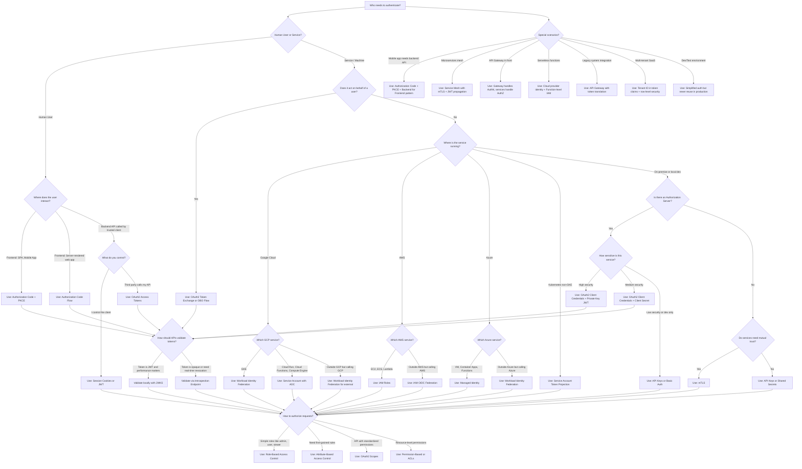

# M2M-AuthZ-with-OIDC
Service-to-Service Authentication with OAuth 2.0 and OpenID Connect

```mermaid
flowchart TD
    Start[Who needs to authenticate?] --> A{Human User or Service?}
    
    %% HUMAN USER PATH
    A -->|Human User| B{Where does the user interact?}
    B -->|Frontend: SPA, Mobile App| C[Use: Authorization Code + PKCE]
    B -->|Frontend: Server-rendered web app| D[Use: Authorization Code Flow]
    B -->|Backend API called by trusted client| E{What do you control?}
    E -->|I control the client| F[Use: Session Cookies or JWT]
    E -->|Third party calls my API| G[Use: OAuth2 Access Tokens]
    
    %% SERVICE PATH
    A -->|Service / Machine| H{Does it act on behalf of a user?}
    H -->|Yes| I[Use: OAuth2 Token Exchange or OBO Flow]
    H -->|No| J{Where is the service running?}
    
    %% CLOUD PROVIDERS
    J -->|Google Cloud| K{Which GCP service?}
    K -->|GKE| L[Use: Workload Identity Federation]
    K -->|Cloud Run, Cloud Functions, Compute Engine| M[Use: Service Account with ADC]
    K -->|Outside GCP but calling GCP| N[Use: Workload Identity Federation for external]
    
    J -->|AWS| O{Which AWS service?}
    O -->|EC2, ECS, Lambda| P[Use: IAM Roles]
    O -->|Outside AWS but calling AWS| Q[Use: IAM OIDC Federation]
    
    J -->|Azure| R{Which Azure service?}
    R -->|VM, Container Apps, Functions| S[Use: Managed Identity]
    R -->|Outside Azure but calling Azure| T[Use: Workload Identity Federation]
    
    %% OTHER ENVIRONMENTS
    J -->|Kubernetes non-GKE| U[Use: Service Account Token Projection]
    J -->|On-premise or local dev| V{Is there an Authorization Server?}
    V -->|Yes| W{How sensitive is this service?}
    W -->|High security| X[Use: OAuth2 Client Credentials + Private Key JWT]
    W -->|Medium security| Y[Use: OAuth2 Client Credentials + Client Secret]
    W -->|Low security or dev only| Z[Use: API Keys or Basic Auth]
    V -->|No| AA{Do services need mutual trust?}
    AA -->|Yes| AB[Use: mTLS]
    AA -->|No| AC[Use: API Keys or Shared Secrets]
    
    %% TOKEN VALIDATION
    C --> TV{How should APIs validate tokens?}
    D --> TV
    G --> TV
    I --> TV
    X --> TV
    Y --> TV
    
    TV -->|Token is JWT and performance matters| JWT[Validate locally with JWKS]
    TV -->|Token is opaque or need real-time revocation| OPQ[Validate via Introspection Endpoint]
    
    %% AUTHORIZATION
    JWT --> AZ{How to authorize requests?}
    OPQ --> AZ
    F --> AZ
    L --> AZ
    M --> AZ
    P --> AZ
    S --> AZ
    U --> AZ
    AB --> AZ
    Z --> AZ
    AC --> AZ
    N --> AZ
    Q --> AZ
    T --> AZ
    
    AZ -->|Simple roles like admin, user, viewer| RBAC[Use: Role-Based Access Control]
    AZ -->|Need fine-grained rules| ABAC[Use: Attribute-Based Access Control]
    AZ -->|API with standardized permissions| SCOPE[Use: OAuth2 Scopes]
    AZ -->|Resource-level permissions| PERM[Use: Permission-Based or ACLs]
    
    %% SPECIAL CASES
    Start --> SC{Special scenarios?}
    SC -->|Mobile app needs backend API| MOB[Use: Authorization Code + PKCE + Backend for Frontend pattern]
    SC -->|Microservices mesh| MESH[Use: Service Mesh with mTLS + JWT propagation]
    SC -->|API Gateway in front| GW[Use: Gateway handles AuthN, services handle AuthZ]
    SC -->|Serverless functions| SLESS[Use: Cloud provider identity + Function-level IAM]
    SC -->|Legacy system integration| LEG[Use: API Gateway with token translation]
    SC -->|Multi-tenant SaaS| MT[Use: Tenant ID in token claims + row-level security]
    SC -->|Dev/Test environment| DEV[Use: Simplified auth but never reuse in production]
```
